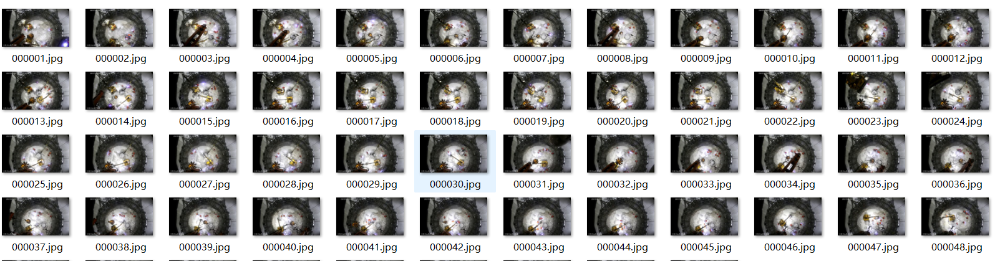

<h1>每隔一段时间读取视频中的视频帧导出脚本</h1>
遍历目标文件夹和其所有子文件夹的视频文件且每隔一段时间提取一张视频帧（截图），把所有截图按照000001.jpg,000002.jpg,000003.jpg这样的规则保存到目标文件夹中。
支持的视频格式为：<code>.mp4</code>, <code>.avi</code>, <code>.mov</code>, <code>.mkv</code>

使用方法：

Linux系统：
```
python video_frame_extractor.py /path/to/source/folder /path/to/target/folder --frame_frequency 60

```
Windows系统示例：
```
python video_frame_extractor.py "E:" "C:\Users\nrynr\Pictures\temp_pic" --frame_frequency 60
```
参数介绍：

`source_folder`:需要处理的文件夹地址

`target_folder`：输出文件夹位置

`frame_frequency`：每隔多少秒截图一张，默认为80

效果预览：
